# Modulation demo codes in GNU radio by using HackRF-ONE as TX and RTL-SDR as RX

Welcome to the simulation-based code series repository! This repository contains Python and GNU Radio Companion (GRC) files for simulating various modulation techniques, including AM, ASK, FSK, QPSK, OQPSK, NBFM, WBFM, SSB LSB, and SSB USB. The transmission is simulated using HackRF, and reception is simulated using RTLSDR.

## Files Included

- `Main.py`: This file serves as the entry point to access all simulation files. Simply run this file to execute the simulations.
- Python files for transmitter and receiver simulations for each modulation technique.
- GNU Radio Companion (GRC) files for transmitter and receiver simulations.

## Supported Modulations

1. AM (Amplitude Modulation)
2. ASK (Amplitude Shift Keying)
3. FSK (Frequency Shift Keying)
4. QPSK (Quadrature Phase Shift Keying)
5. OQPSK (Offset Quadrature Phase Shift Keying)
6. NBFM (Narrowband Frequency Modulation)
7. WBFM (Wideband Frequency Modulation)
8. SSB LSB (Single Sideband Lower Sideband)
9. SSB USB (Single Sideband Upper Sideband)

## Usage

1. Clone this repository to your local machine.
2. Ensure you have Python installed along with the required libraries.
3. Install GNU Radio Companion if not already installed.
4. Run `Main.py`.
5. Select the desired modulation technique from the menu.
6. Follow the instructions to run the simulation.

## Here are some sScreenshots

### Main.py

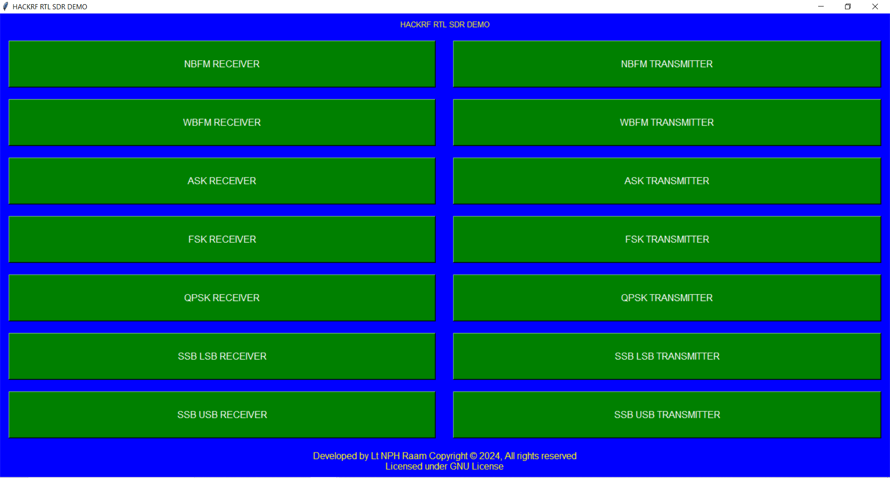

### ASK TX and RX

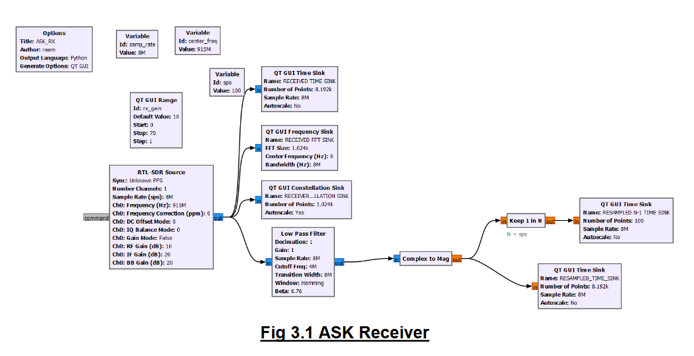

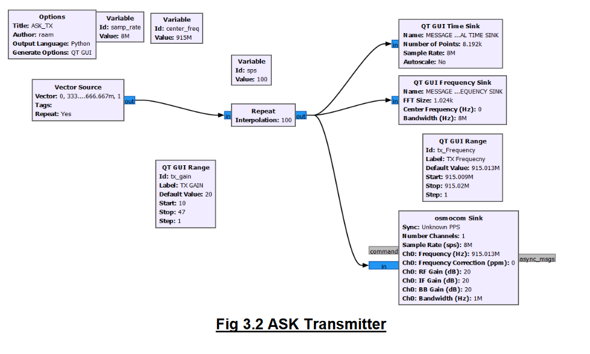

### FSK TX and RX

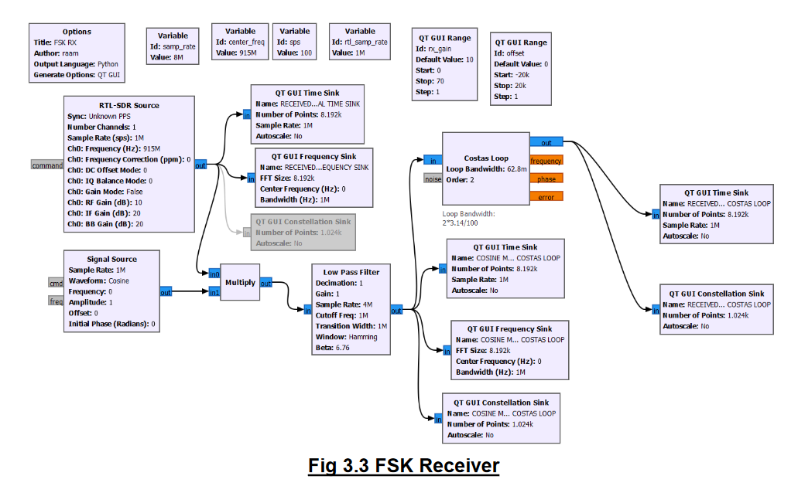

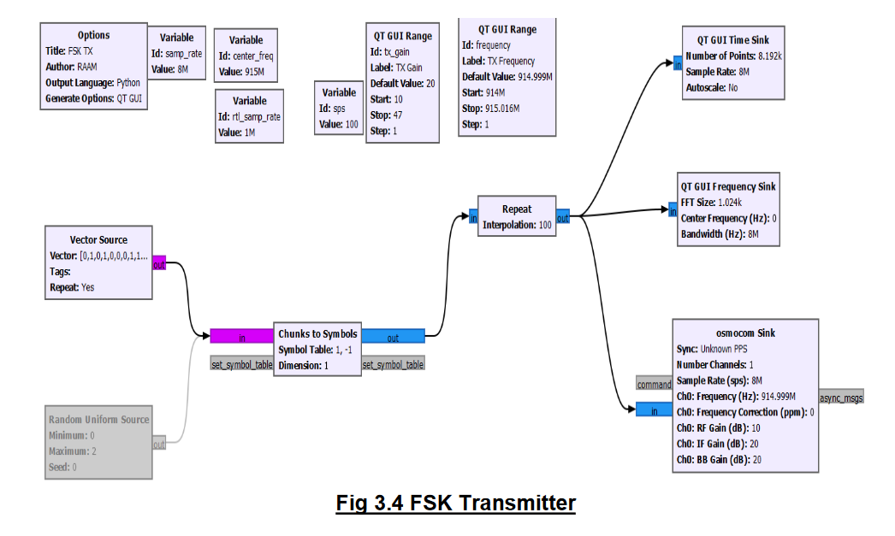

### NBFM TX and RX

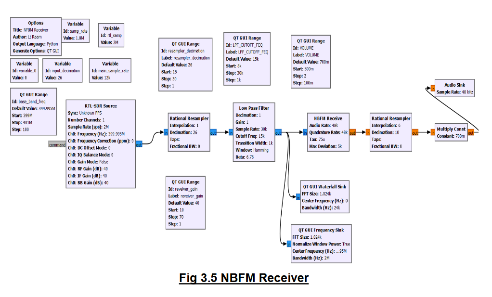

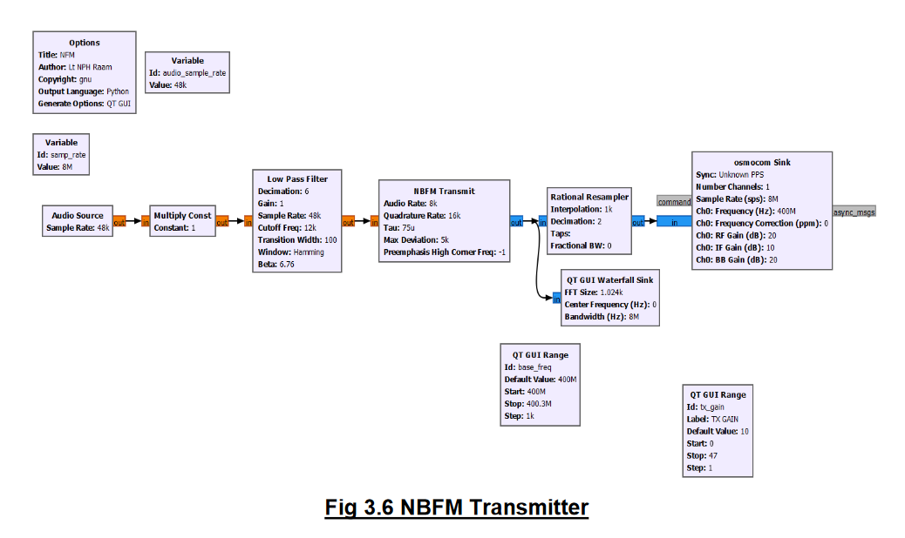

### WBFM TX and RX

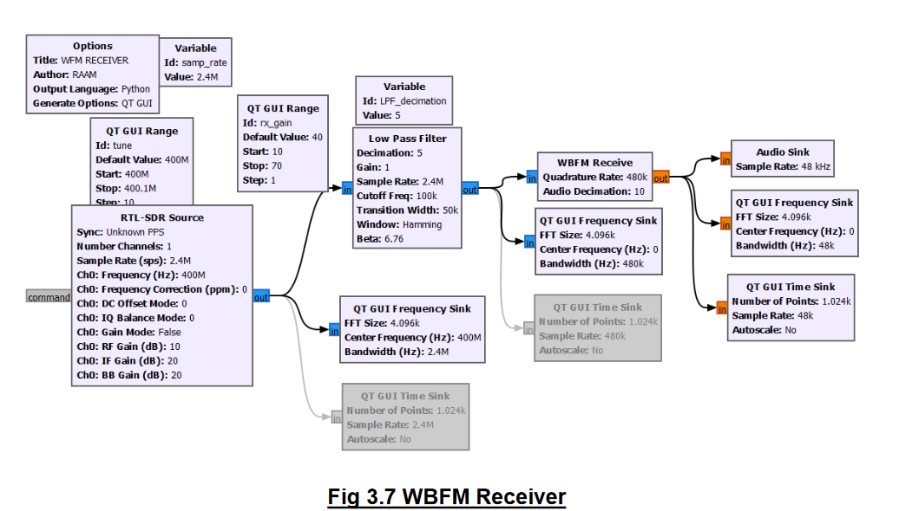

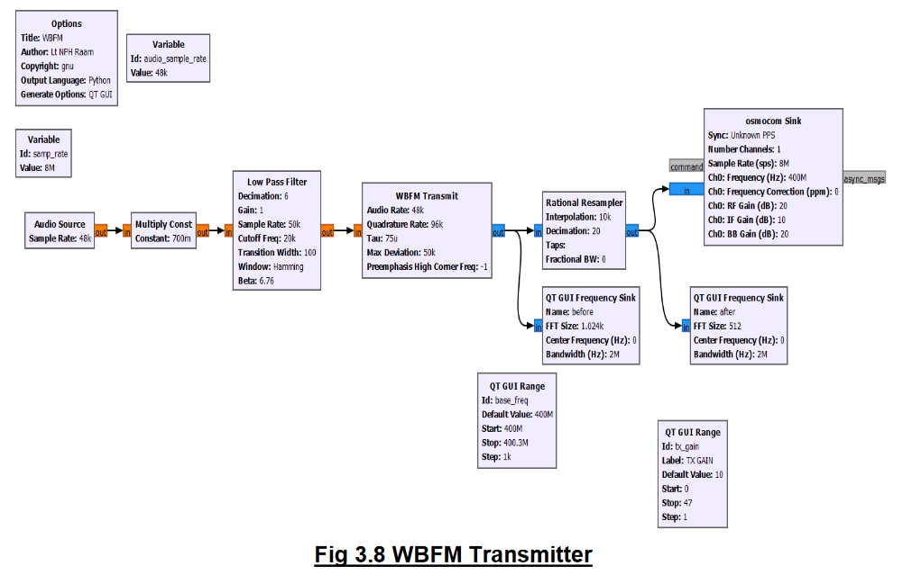

### QPSK TX and RX

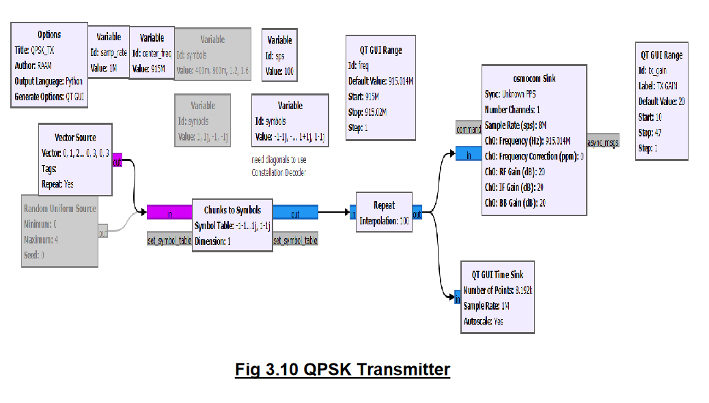

### SSB LSB TX and RX

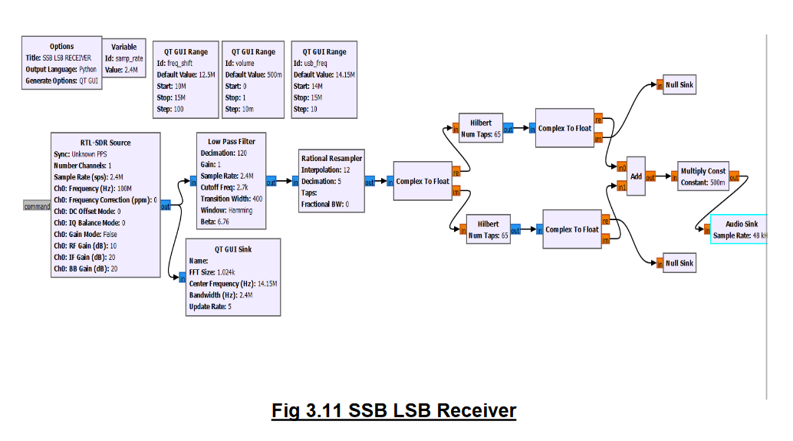

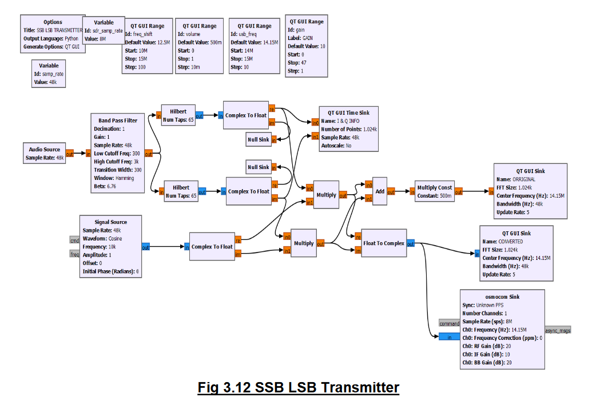

### SSB USB TX and RX

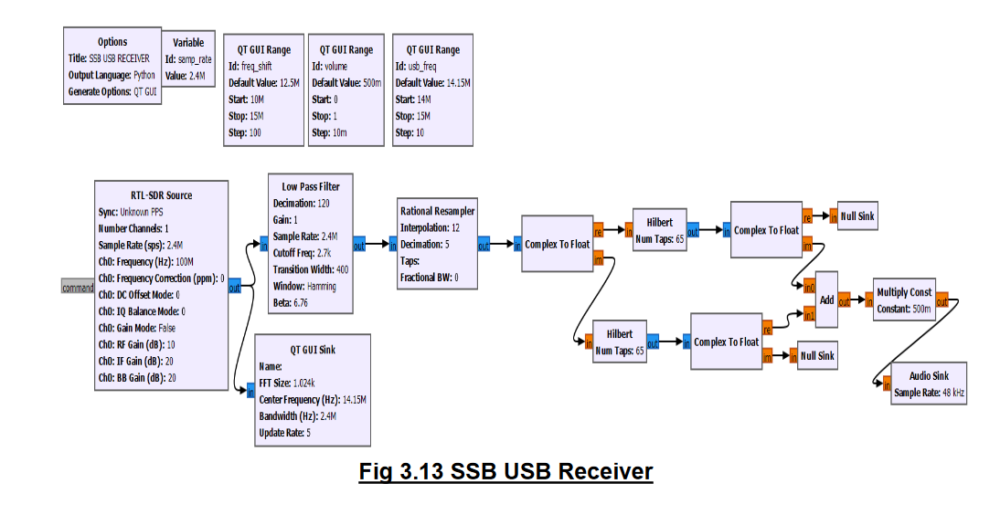

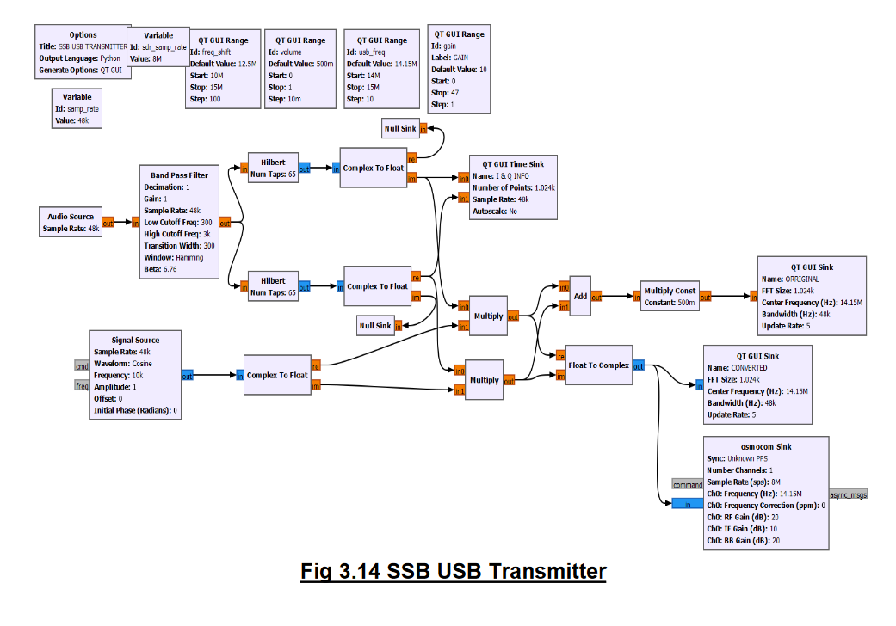

## License

This project is licensed under the [MIT License](LICENSE).

Feel free to contribute, report issues, or suggest improvements. Happy simulating! 🚀
